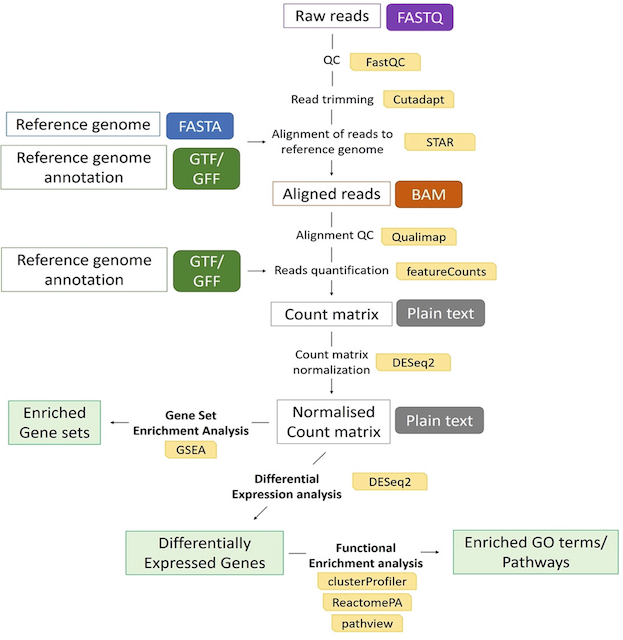

# Endothelial Cell RNA-seq Data: Differential Expression and Functional Enrichment Analyses to Study Phenotypic Switching

A user-friendly bioinformatics workflow to take raw data produced by RNA sequencing to interpretable results. The workflow described here was performed using Ubuntu 20.04.2 LTS, a Linux distribution. 

The published protocol can be found under [Chapter 29](<https://doi.org/10.1007/978-1-0716-2059-5_29>) of [Angiogenesis Methods and Protocols 2022](<https://doi.org/10.1007/978-1-0716-2059-5>).

<br />

## Table of Contents
<ol>
  <li>
    <a href="https://github.com/vasc-bioinf/rnaseq_exp/blob/main/README.md#bioinformatics-workflow">Bioinformatics Workflow</a>
  </li>
  <li>
    <a href="https://github.com/vasc-bioinf/rnaseq_exp/blob/main/README.md#software-and-r-packages">Software and R Packages</a>
  </li>
  <li>
    <a href="https://github.com/vasc-bioinf/rnaseq_exp#workspace-preparation">Workspace Preparation</a>
  </li>
  <li>
    <a href="https://github.com/vasc-bioinf/rnaseq_exp#software-installation">Software Installation</a>
  </li>
  <li>
    <a href="https://github.com/vasc-bioinf/rnaseq_exp/blob/main/README.md#raw-reads-download">Raw Reads Download</a>
  </li>
  <li>
    <a href="https://github.com/vasc-bioinf/rnaseq_exp/blob/main/README.md#reference-genome-download">Reference Genome Download</a>
  </ol>

<br />
  
## Bioinformatics Workflow

The steps of the workflow are shown in the flowchart. The tools used are in yellow boxes, the data required/produced in white boxes and file formats in purple, blue, dark green, orange and grey boxes. Results obtained are in light green boxes.

<br />
<div align="center">
  
  </a>
</div>

<br />

## Software and R Packages

Below is a list of the software and R packages used in workflow with the corresponding URL.

<div align="center">
  
| Software | URL |
| --- | --- |
Ubuntu | https://ubuntu.com/
FastQC | https://www.bioinformatics.babraham.ac.uk/projects/fastqc/
Cutadapt | https://github.com/marcelm/cutadapt
STAR | https://github.com/alexdobin/STAR
Qualimap | http://qualimap.conesalab.org/
Subread (featureCounts) | http://subread.sourceforge.net/
R | https://www.r-project.org/
Rstudio | https://www.rstudio.com/
DESeq2 | https://bioconductor.org/packages/release/bioc/html/DESeq2.html
clusterProfiler | https://bioconductor.org/packages/release/bioc/html/clusterProfiler.html
pathview | http://www.bioconductor.org/packages/release/bioc/html/pathview.html
ReactomePA | https://bioconductor.org/packages/release/bioc/html/ReactomePA.html
enrichplot | https://bioconductor.org/packages/release/bioc/html/enrichplot.html
biomaRt | https://bioconductor.org/packages/release/bioc/html/biomaRt.html
ggplot2 | https://ggplot2.tidyverse.org/
GO | http://geneontology.org/
KEGG | https://www.genome.jp/kegg/
Reactome | https://reactome.org/
GSEA | https://www.gsea-msigdb.org/gsea/index.jsp
  
</div>
<div>

<br />

## Workspace Preparation

The commands used in the workflow, as seen in [software_downloads](software_downloads/) and [pipeline_commands](pipeline_commands/) use relevant file paths. Throughout the workflow, when a path containing "user" is shown (e.g., /home/user/rnaseq_exp), "user" represents the user's name and should be replaced by it.

Key directories to be made prior to software installation and raw data download.

1. Change directory to 'user'
   ```sh
   cd /home/user
   ```
  
2. Make a new directory called 'rnaseq_exp'
   ```sh
   mkdir rnaseq_exp
   ```

3. Change directory to 'rnaseq_exp'
   ```sh
   cd rnaseq_exp
   ```
  
4. Make new directories called 'output', 'raw_data', resources', 'programs'
   ```sh
   mkdir output raw_data resources programs
   ```


<br />

## Software Installation
The required software and R packages can be installed by following the commands in the files within the [software_downloads](software_downloads/) directory.

Refer to section 3.2 of the [published protocol](<https://doi.org/10.1007/978-1-0716-2059-5_29>) for more information.

<br />


## Raw Reads Download

A publicly available HUVEC dataset is used from a published study [Andrade J et al (2021) Control of endothelial quiescence by FOXO-regulated metabolites. Nat Cell Biol 23(4):413–423](<https://www.nature.com/articles/s41556-021-00637-6>)


## Reference Genome Download


<p align="right">(<a href="#top">back to top</a>)</p>

